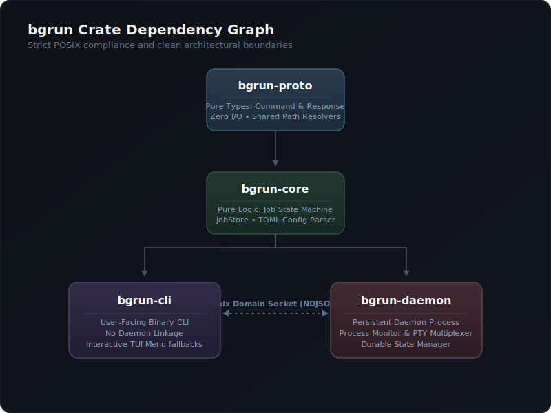

# Architecture

bgrun is split into 4 crates with a strict dependency graph. The daemon and CLI never link directly — they communicate over a Unix socket using a plain-text NDJSON protocol.

## Crate layout



- **`bgrun-proto`** — zero I/O. Types only. Any crate can depend on it.
- **`bgrun-core`** — zero I/O. Pure logic and data structures. Depends only on `bgrun-proto`.
- **`bgrun-cli`** — depends on `bgrun-proto` + `bgrun-core`. Talks to daemon over Unix socket.
- **`bgrun-daemon`** — depends on `bgrun-proto` + `bgrun-core`. Full daemon with tokio, nix, tracing.

The CLI never imports `bgrun-daemon`. Path utilities (`socket_path`, `state_dir`) are in `bgrun-proto::paths` so both crates share them without coupling.

---

## Daemon lifecycle

### Startup

1. The CLI detects whether the daemon socket exists.
2. If missing, it spawns `bgrun-daemon` as a child process (no arguments).
3. The daemon process forks itself:
   - The parent exits immediately, returning control to the CLI.
   - The child continues as the actual daemon.
4. The child calls `setsid()` to create a new session and detach from the terminal.
5. `BGRUN_DAEMONIZED=1` is set to prevent recursive double-fork.

### Socket setup

The daemon binds a Unix domain socket at `$XDG_RUNTIME_DIR/bgrun/daemon.sock` (or `/tmp/bgrun-$UID/daemon.sock` as fallback). It listens in a tokio accept loop, spawning a new task per connection.

### Orphan re-adoption

On startup, the daemon reads all persisted jobs from `$XDG_DATA_DIR/bgrun/jobs/$ID/`:

1. **If PID is alive** (`kill(pid, 0)` succeeds): the job is re-inserted into the in-memory store and a background task monitors it every 2 seconds.
2. **If PID is dead**: the job is marked `Crashed` in status.json.

This ensures no monitoring gap after a daemon restart.

### Shutdown

The daemon runs until killed (`pkill bgrun-daemon`) or an idle timeout expires. On restart via the CLI, the new instance re-adopts orphaned children as described above.

### Reactive idle auto-shutdown

The daemon spawns a background monitor that uses `tokio::sync::Notify` for **zero-CPU idle polling**:

1. A global `LIFECYCLE_NOTIFY` static is defined in `runner.rs`.
2. Every job spawn (`spawn_job`, `spawn_pty_job`) and job exit (`handle_job_exit`) calls `.notify_one()`.
3. The monitor loop:
   - **Active jobs > 0**: parks indefinitely on `.notified().await` — 0 CPU usage.
   - **Active jobs = 0**: races `.notified()` against `BGRUN_IDLE_TIMEOUT` (default 60s).
4. On timeout expiry, the socket file is deleted and the process exits.

This replaces any periodic polling approach, ensuring the daemon consumes no CPU while idle.

---

## Protocol

The CLI and daemon communicate over a Unix socket using **NDJSON** (Newline-Delimited JSON).

### Request

```json
{"id":"req-uuid","command":"Run","args":{"cmd":["sleep","300"],"name":"sleeper",...}}
```

One JSON object per line. The `command` field uses tagged enum serialization (`serde`'s `#[serde(tag = "command", content = "args")]`) so all commands share the same outer envelope.

### Response

```json
{"id":"req-uuid","ok":true,"data":{"id":"abc123","state":"running",...}}
{"id":"req-uuid","ok":false,"error":"job not found"}
```

Every request gets exactly one response line. The response format is:
- `req_id` — matches the request's `id`
- `ok` — boolean success indicator
- `data` — command-specific payload (only when `ok` is true)
- `error` — error message string (only when `ok` is false)

### Commands

| Command | Request args | Response data |
|---|---|---|
| `Run` | `RunArgs { cmd, name, workspace, readiness, restart, pty, max_runtime_ms, max_rss_mb, env, after, cwd, pty_cols, pty_rows }` | `JobRecord` |
| `RunGroup` | `{ jobs: Vec<RunArgs> }` | `Vec<JobRecord>` |
| `Status` | `{ id }` | `JobStatus` |
| `List` | `{ workspace? }` | `Vec<JobRecord>` |
| `Kill` | `{ id?, workspace? }` | `{ killed: Vec<String> }` |
| `Tail` | `{ id, lines, digest, level?, strip_ansi }` | `{ lines: Vec<LogLine> }` or `LogDigest` |
| `Diff` | `{ id, lines?, strip_ansi }` | `{ cursor: u64, lines: Vec<LogLine> }` |
| `Wait` | `{ id, timeout_ms }` | `WaitResult { ready: bool, elapsed_ms: u64 }` |
| `Send` | `{ id, data }` | `{ ok: true }` |
| `Stats` | `{ id }` | `ResourceStats { cpu_pct, rss_mb, uptime_secs }` |
| `Attach` | `{ id }` | hijacks socket for raw byte streaming |
| `Expect` | `{ id, pattern, is_regex, timeout_ms }` | `{ matched: bool, line_number, content }` |
| `ResizePty` | `{ id, cols, rows }` | `{ resized: true }` |

---

## Process lifecycle

### Spawn (runner.rs)

1. **Idempotency check**: if a named job already exists and is alive, return its record.
2. **Dependency wait**: if `after` is set, poll the store until the named job reaches `Ready`, `Exited`, `Crashed`, or `Killed` (120s timeout).
3. **Spawn**: `tokio::process::Command` with piped stdin/stdout/stderr, process group 0.
4. **Output capture**: stdout and stderr are piped to async tasks that write to `stdout.log` with log rotation at 50MB.
5. **Stdin handle**: stored in a global `HashMap<String, ChildStdin>` keyed by job ID.
6. **Ready check**: if `readiness` is set, spawn a background task that polls every 200ms up to 60s.
7. **Max runtime**: if `max_runtime_ms` is set, a tokio sleep task fires after the duration, killing the job if still alive.
8. **Memory limit**: if `max_rss_mb` is set, a background task polls RSS every 1s and kills the job if exceeded.
9. **Lifecycle notify**: `LIFECYCLE_NOTIFY.notify_one()` is called to wake the auto-shutdown monitor.
10. **Persist**: write `meta.json` (full `JobRecord`) and `status.json` to disk.

### Monitor

After spawn, the daemon spawns `monitor_job()` which:
1. Awaits the child process exit.
2. Determines exit type (SIGKILL → Crashed, non-zero exit → Crashed, zero exit → Exited).
3. If `restart = OnCrash` and the process crashed, spawns a new instance after `backoff_ms` delay.
4. Writes status.json.

### Kill

1. Send `SIGTERM` to the process group (`killpg`).
2. Wait up to 5 seconds.
3. If still alive, send `SIGKILL` to the process group.
4. Transition state to `Killed`.

---

## Readiness system

Four checker implementations, all implementing the `ReadinessChecker` async trait:

| Strategy | Checker | Mechanism |
|---|---|---|
| `LogPattern("string")` | `LogPatternChecker` | Reads the log file from last offset, searches for substring. Offset-tracked to avoid re-scanning. |
| `TcpPort(3000)` | `TcpPortChecker` | `TcpStream::connect("127.0.0.1:3000")` |
| `HttpPoll("http://...")` | `HttpPollChecker` | `reqwest::GET`, 500ms timeout, checks for 2xx |
| `FileExists("/path")` | `FileExistsChecker` | `tokio::fs::metadata()` |

The `readiness_loop` polls the checker every 200ms. Exits immediately if:
- Checker returns `true` → transition to `Ready`, persist status.
- Job is no longer alive (killed/crashed) → stop polling.
- 60-second timeout elapses → stop polling (job stays in `Running`).

---

## Persistence

Jobs are persisted to disk under `$XDG_DATA_DIR/bgrun/jobs/$ID/`:

```
jobs/abc123/
├── meta.json     # Full JobRecord (cmd, name, workspace, pid, state, readiness, restart, pty, max_runtime, max_rss_mb, env)
├── status.json   # Current state, exit_code, ready_at, restart_count, cursor
└── stdout.log    # Captured stdout/stderr (rotated at 50MB → stdout.log.1)
```

- **meta.json** is written once on spawn. Contains all configuration needed to re-create the job.
- **status.json** is updated on state transitions. Restored on daemon restart.
- **stdout.log** grows unbounded. Rotated at 50MB. The daemon writes with `tokio::fs::File::create(true).append(true)`.

An audit log at `$XDG_DATA_DIR/bgrun/audit.log` records daemon startup timestamps in NDJSON format.

---

## Resource monitoring

A global `SYSINFO_SYSTEM` static (`once_cell::sync::Lazy<Arc<Mutex<System>>>`) is initialized once in `runner.rs`. Both `get_stats` and the memory monitor share this single instance, avoiding per-call allocation:

```rust
let mut sys = SYSINFO_SYSTEM.lock().unwrap();
sys.refresh_processes(ProcessesToUpdate::All);
let proc = sys.process(Pid::from_u32(pid));
// proc.cpu_usage(), proc.memory(), proc.run_time()
```

### Memory RSS guardrails

When `--max-rss <MB>` is passed to `bgrun run`, the daemon spawns `monitor_memory_limit()` — a tokio task that polls RSS every 1 second. If the process exceeds the limit, it is killed through the normal kill flow (SIGTERM → SIGKILL).

The `max_rss_mb` value is persisted in `meta.json` and restored on daemon restart, so memory limits survive reboots.

---

## Tool schemas

`bgrun schema <command>` prints JSON Schema (draft-07) for any command's argument struct using the `schemars` crate. The derive macros are on `RunArgs`, `KillArgs`, `TailArgs`, `Command`, `ReadinessStrategy`, and `RestartPolicy` in `bgrun-proto`.

This allows AI agents to discover expected input shapes at runtime without hardcoded tool definitions.

---

## ID resolution

`JobStore::resolve_id()` accepts three formats:
1. **Full UUID** — exact match against the job's canonical ID.
2. **Job name** — exact match against the name index (`--name`).
3. **Unique prefix** — at least 4 characters matching exactly one job's UUID.

This is called at the start of every daemon handler, so `bgrun tail abc1`, `bgrun status my-server`, and `bgrun kill 55f3a` all work transparently.

---

## Log tail implementation

`tail_lines` uses a two-pass approach to avoid loading the entire file into memory:

1. **Pass 1**: scan forward, tracking newline byte positions in a ring buffer of N+1 entries.
2. **Pass 2**: seek to the start offset of the Nth-from-last line, read only that tail portion.

`diff_since` seeks directly to the cursor offset from `status.json`, counting lines from start for correct line numbering.

This works for log files of any size without O(file_size) memory usage.
